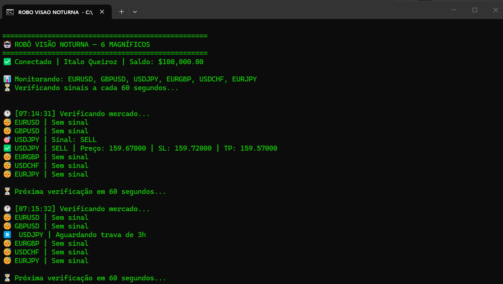
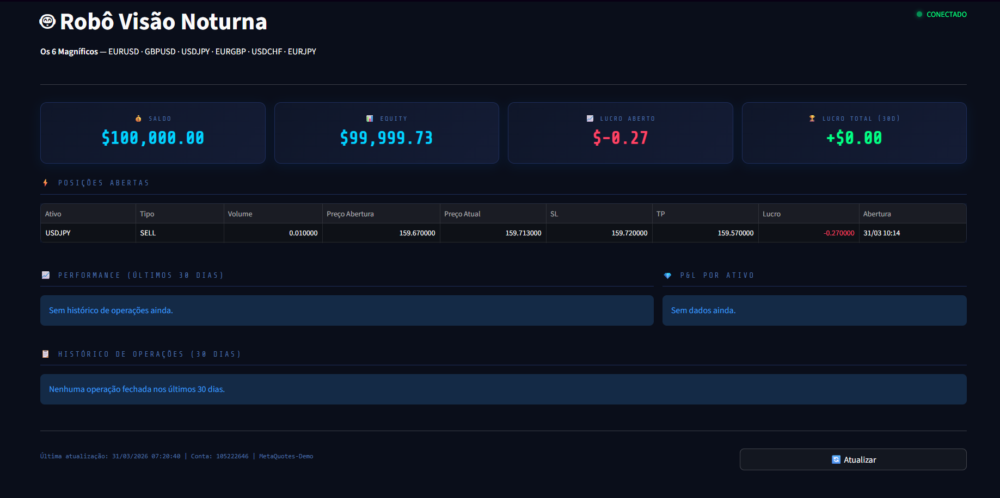

# 🤖 Robô Visão Noturna — Forex IA


> Algoritmo de negociação quantitativa conectado ao MetaTrader 5, com dashboard de monitoramento em tempo real e lançador com duplo clique.

---

## 📸 Screenshots

### 🖥️ Terminal do Robô


### 📊 Dashboard em Tempo Real


---

## 📊 Resultados do Backtest

| Métrica | Resultado |
|---|---|
| Período testado | 5 meses (cego) |
| Capital simulado | $10.000 |
| Lucro total | $770,80 |
| Retorno total | **7,708%** |
| Média mensal | **1,54%** |
| Equivalente anual | **~18,5%** |
| Comparação | Acima do S&P 500 histórico |

---

## 🏦 Os 6 Magníficos

| Ativo | Par | Sessão Principal |
|---|---|---|
| EURUSD | Euro / Dólar | Europeia |
| GBPUSD | Libra / Dólar | Europeia |
| USDJPY | Dólar / Iene | Asiática/Europeia |
| EURGBP | Euro / Libra | Europeia |
| USDCHF | Dólar / Franco Suíço | Europeia |
| EURJPY | Euro / Iene | Asiática/Europeia |

---

## ⚙️ Arquitetura

```
forex-ia-robot/
├── robo_visao_forex.py        # Motor principal do robô
├── dashboard.py               # Dashboard Streamlit (tempo real)
├── teste_conexao.py           # Script de diagnóstico MT5
├── INICIAR_VISAO_NOTURNA.bat  # Lançador com duplo clique
├── CRIAR_ATALHO_DESKTOP.vbs   # Cria ícone na área de trabalho
├── assets/
│   ├── terminal.png           # Print do terminal do robô
│   └── dashboard.png          # Print do dashboard
├── requirements.txt           # Dependências Python
└── .gitignore                 # Arquivos ignorados pelo Git
```

### Lógica do Sinal

```
MA Rápida (9) cruza acima de MA Lenta (21) + RSI < 65  →  BUY
MA Rápida (9) cruza abaixo de MA Lenta (21) + RSI > 35  →  SELL
```

### Gestão de Risco

- Stop Loss: 50 pontos por operação
- Take Profit: 100 pontos por operação (R:R 1:2)
- Trava de 3 horas entre operações por ativo
- Volume mínimo: 0.01 lote

---

## 🚀 Instalação

### Pré-requisitos

- Windows 10/11
- [Python 3.10](https://www.python.org/downloads/release/python-3100/)
- [MetaTrader 5](https://www.metatrader5.com/pt/download) (versão oficial MetaQuotes)
- Conta demo em qualquer corretora compatível com MT5

### Passo a passo

**1. Clone o repositório**
```bash
git clone https://github.com/ItaloQueirooz/forex-ia-robot.git
cd forex-ia-robot
```

**2. Instale as dependências**
```bash
python -m pip install MetaTrader5 pandas numpy streamlit
```

**3. Configure suas credenciais**

Abra `robo_visao_forex.py` e `dashboard.py` e preencha:
```python
LOGIN    = 00000000          # seu login numérico do MT5
SENHA    = "SUA-SENHA-AQUI"  # sua senha do MT5
SERVIDOR = "MetaQuotes-Demo" # seu servidor
```

**4. Crie o atalho da área de trabalho**

Dê duplo clique em `CRIAR_ATALHO_DESKTOP.vbs` — um ícone será criado na sua área de trabalho.

---

## 🖥️ Como usar

### Opção 1 — Duplo clique (recomendado)

1. Dê **duplo clique** no ícone **"Robô Visão Noturna"** na área de trabalho
2. O sistema irá automaticamente:
   - Verificar se o MT5 está aberto (abre sozinho se necessário)
   - Iniciar o robô em uma janela dedicada
   - Iniciar o dashboard e abrir o navegador
3. Acesse o dashboard em: `http://localhost:8501`

> ⚠️ **Não feche as janelas pretas** — elas são o robô e o dashboard rodando.

### Opção 2 — Manual via terminal

Robô:
```bash
python robo_visao_forex.py
```

Dashboard:
```bash
python -m streamlit run dashboard.py
```

---

## 📈 Dashboard

O dashboard (`dashboard.py`) exibe em tempo real:

- 💰 **Saldo e Equity** da conta
- ⚡ **Posições abertas** com preço de entrada, SL, TP e lucro atual
- 📈 **Gráfico de performance acumulada** (últimos 30 dias)
- 💎 **P&L por ativo** — quais pares estão gerando mais resultado
- 📋 **Histórico de operações** fechadas

Atualiza automaticamente a cada 30 segundos.

---

## ⚠️ Aviso de Risco

Este software é fornecido para fins educacionais e de pesquisa. Operações em mercados financeiros envolvem risco de perda de capital. Resultados passados não garantem resultados futuros. Sempre teste em conta demo antes de operar com capital real.

---

## 🗺️ Roadmap

- [x] Algoritmo base (MA + RSI)
- [x] Backtest multi-ativo
- [x] Conexão com MetaTrader 5
- [x] Dashboard em tempo real
- [x] Lançador com duplo clique
- [ ] Forward Testing 30 dias em conta demo
- [ ] Sistema de alertas via Telegram
- [ ] Deploy em VPS para operação 24/7
- [ ] Integração com mesa proprietária (Prop Firm)

---

## 👤 Autor

**Italo Queiroz**
- GitHub: [@ItaloQueirooz](https://github.com/ItaloQueirooz)

---

*Desenvolvido com Python 🐍 + MetaTrader 5 📊*
